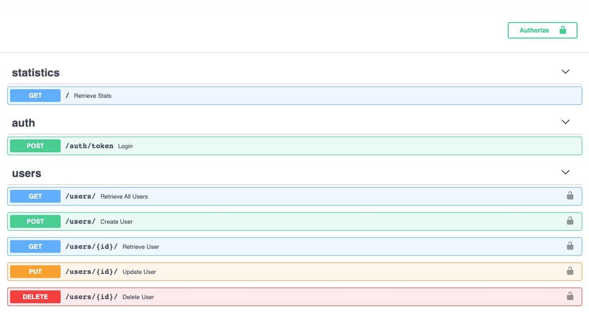

# NEP User Service

Build the image and run the container:
```sh
$ docker-compose build 
$ docker-compose up
```sh

Total user count and User count per country statistics:
```sh
http://127.0.0.1:8000/
```sh

Swagger UI:
```sh
http://127.0.0.1:8000/docs 
```sh

Use those credentials to authorize and try to query endpoints:
```sh
odin - login
password - password
```sh


